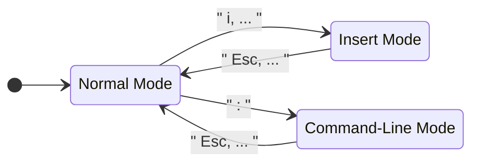
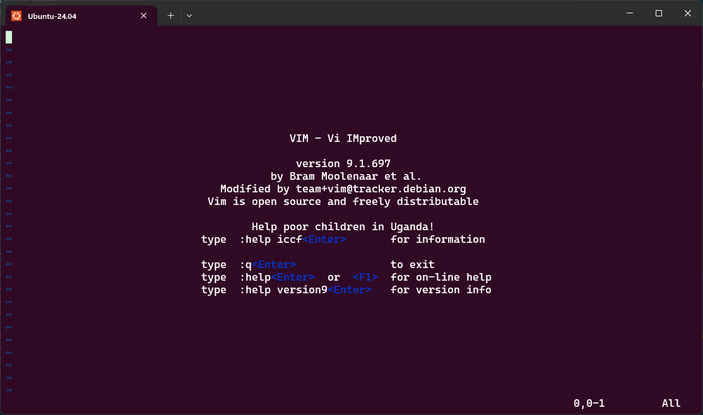

<!---
{
  "id": "2c7334b3-b07d-48d6-a562-79072d8e166e",
  "depends_on": ["ed", "apt"],
  "author": "Stephan Bökelmann",
  "first_used": "2025-03-26",
  "keywords": ["vim", "exercise", "texteditor"]
}
--->

# Editing Files from your Terminal with VIM

## 1) Introduction
`vim` is a powerful and versatile text editor that is widely used for software development, system administration, and other technical tasks. Mastering `vim` can significantly enhance productivity, as it allows for rapid text editing and navigation with minimal to non reliance on the mouse.

In this challenge, you will practice some fundamental commands. The goal is to help you gain confidence in opening, editing, and saving files within Vim. Learning Vim is a foundational skill for anyone working in the command-line environment and provides a stepping stone for mastering more advanced text-editing techniques.

When working with `vim`, its important to recall how Linux works with files in general:
The user-space program requests the content of a file through [system calls](www.github.com/STEMgraph/missing), like `open()`, `read()` or `mmap()`. 
The kernel then interacts with the file system to locate the requested file and transfer a copy of it into the RAM, which is associated with the new process.
What this means for the user is, that they are not actually working with the file, but with a copy. 
If the copy is manipulated, this manipulation needs to be written back to the original location in storage, this way the manipulated file can be found using the same path later on.

In order to not be fully confused with `vim` - or any other interactive commandline texteditor - you have to accept that the mouse is not an option. 
An understanding of the three basic states in which `vim` can be is essential for working with it. 

Consider the diagram above. When `vim` has just been opened, it is in the `normal`-mode. This means, that you can navigate to other modes from here or can use some very specific hot-keys, that we don't want to go into here. 

If you ever get stuck in `vim` your first goal is to get the program back to `normal`-mode this usually works by pressing the `Esc`-Key.
From there we will explore two of `vim`s multiple modes: `insert`-mode and `terminal`-mode. 
While the `insert`-mode is used to write your text, the `terminal`-mode can be considered as a substitution of all the things you might want to do with a mouse in Word, such as opening and saving a file. 

This exercise will teach you how to open a file, manipulate it, write it back to storage and close the application. 

### 1.1) Further Readings and Other Sources
- [Learn-Vim - An extensive guide to vim](https://github.com/iggredible/Learn-Vim)
- `vimtutor` - An interactive learning-experience if you have `vim` already installed: just type `vimtutor` into your commandline and press `Return`

## 2) Tasks
1. **Installing vim**: Install `vim`. Either by using your packagemanager or by downloading the installer from the `vim` website.
2. **Opening vim**: Navigate to your home-directory. When you arrive, type `vim` and press `Return`. The screen that you now see is an empty home-screen. No file is opened yet.

3. **Open an empty Buffer**: If you haven't pressed any button yet, you are in `normal`-mode. If you pressed anythin, just press the `Esc` to get to `normal`-mode. In order to write something, you'll need a block of memory in the RAM, where your text can be stored until you write it to your storage - this is called _a buffer_. Type `:enew`. You should see your written command on the bottom of the screen and press `Return`. `enew` stands for _edit new_. The prepended `:` indicates the `terminal`-mode. 
4. **Add something to your Buffer**: After opening the buffer, press the `i`-key. This brings the application into `insert`-mode. This is also indicated on the bottom of your screen. Type some words and press `Esc` to go back to `normal`-mode.

  
The new Buffer

  You can also press `i` directly from the home screen. `:enew` was just used here to present the concept of a buffer more clearly.

5. **Discard your Buffer**: Back in `normal`-mode, type `:q!` for _quit_. This forces `vim` to close the buffer without writing it to the storage.
6. **Store your Buffer**: Make sure you are in your home-directory or any other directory you can savely add a file to. Repeat steps 2, 3 and 4. Instead of discarding your buffer, type `:w new.txt`. This will _write_ to a new file calles `new.txt`. Close the application with `:q`. 
7. **Open your existing File**: Use `ls` to locate your new file in your home-directory. You can now open it with `vim new.txt`. Go into `insert`-mode and change something within that file. Don't type `:w`, but try to run `:q`. You should now see a message, telling you, that `vim` does not want to end your session, since you buffer has not been stored. Decide for yourself, whether you want to run `:q!` and force quitting without saving or you can combine _write_ and _quit_ to `:wq`. 
8. **Learn more**: In order to get more professional with `vim`, just type `vimtutor` into your terminal and run it. Doing the tutorial takes roughly 30 minutes. 

## 3) Questions
1. What are the three primary modes of `vim`, and how do you switch between them?
2. How do you create and save a new file in `vim`?
3. What is the purpose of the `:enew` command in `vim`?
4. How can you exit `vim` without saving changes?
5. What steps should you follow to open an existing file, make edits, and save the changes in `vim`?

## 4) Advice
Try different other editors in your command-line, to get more familiar with the concept of terminal editing. Other common editors are `nano`, `emacs` or `helix`.
